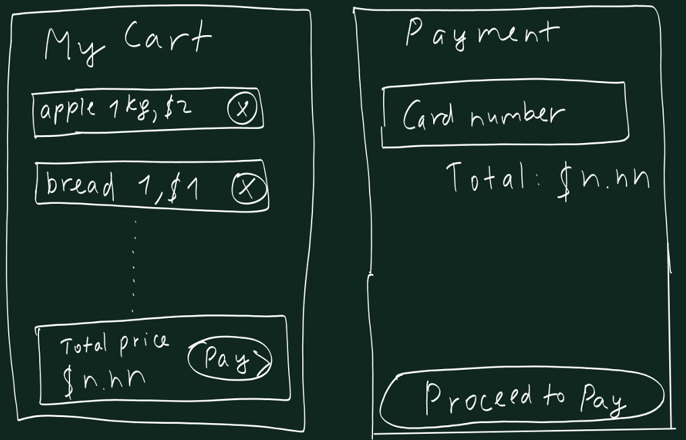

# Online Grocery Shop App

## Introduction

Welcome to the Online Grocery Shop App! This mobile application, developed using Flutter in Dart language, aims to make grocery shopping easier and more convenient. It allows users to browse through a wide range of grocery items, add them to their cart, and check out with ease.

## Features

- **User Authentication**: Users can create an account, log in, and manage their profile.
- **Product Browsing**: Browse through different categories of groceries, such as fruits, vegetables, dairy products, and more.
- **Shopping Cart**: Add items to your cart, adjust quantities, and remove items as needed.
- **Order History**: View your past orders and track your current orders.

## Usage

After starting the app, you can start using the Online Grocery Shop App on your emulator or physical device.

## Documentation

# **Grocery Shopping App Documentation**


## **Requirements Catalogue**

**Functional Requirements**

1. **User Registration**: New users can create an account using their email address. This includes input validation to ensure the email is in the correct format and a system to verify the email address. \
   If a user attempts to register with an email that is already in use, the system should display an error message indicating that the email is already registered.
2. **User Login**: Registered users should be able to log in using their email and password. They should also be able to log in with Google Sign-in. There should be security measures such as password encryption and authentication protocols.
3. **Browse Products**: Users can browse available grocery items.
4. **Add to Cart**: Users can add items to their shopping cart. The system should update the cart in real-time and allow users to view their cart, update quantities, and remove items.
5. **Profile Info**: Users should be able to see and edit their profile information.
6. **Checkout**: Users should be able to purchase and order items in their cart. This includes inputting delivery information(address), choosing a payment method, and confirming the order. The system should provide an order confirmation.
7. **Delivery**: Users should be able to see their items’ delivery status. The system should provide estimated delivery time.


### **Non-Functional Requirements**

1. **Performance**: The app can load product information quickly.
2. **Security**: User data should be stored securely in Firebase.
3. **Usability**: The app should be easy to use, with a user-friendly interface.
1. **Performance**: The app should load product information quickly, even under heavy load. This includes initial startup time, as well as the time it takes to load images and retrieve data from Firebase. The app should also be responsive, with minimal lag when users interact with the UI.
2. **Security**: User data should be stored securely in Firebase. This includes encrypting sensitive data, such as passwords and payment information. The app should also handle authentication securely, preventing unauthorized access to user accounts.
3. **Usability**: The app should be easy to use, with a user-friendly interface. This includes clear navigation, intuitive controls, and helpful error messages.
4. **Reliability**: The app should function correctly and consistently, without crashes or errors. This includes handling edge cases and network failures gracefully.


## **UI/UX design on paper**


<p id="gdcalert1" ><span style="color: red; font-weight: bold">>>>>>  gd2md-html alert: inline image link here (to images/image1.png). Store image on your image server and adjust path/filename/extension if necessary. </span><br>(<a href="#">Back to top</a>)(<a href="#gdcalert2">Next alert</a>)<br><span style="color: red; font-weight: bold">>>>>> </span></p>


## 

<p id="gdcalert2" ><span style="color: red; font-weight: bold">>>>>>  gd2md-html alert: inline image link here (to images/image2.png). Store image on your image server and adjust path/filename/extension if necessary. </span><br>(<a href="#">Back to top</a>)(<a href="#gdcalert3">Next alert</a>)<br><span style="color: red; font-weight: bold">>>>>> </span></p>





<p id="gdcalert3" ><span style="color: red; font-weight: bold">>>>>>  gd2md-html alert: inline image link here (to images/image3.png). Store image on your image server and adjust path/filename/extension if necessary. </span><br>(<a href="#">Back to top</a>)(<a href="#gdcalert4">Next alert</a>)<br><span style="color: red; font-weight: bold">>>>>> </span></p>


## **UML Activity Diagram**


<p id="gdcalert4" ><span style="color: red; font-weight: bold">>>>>>  gd2md-html alert: inline image link here (to images/image4.png). Store image on your image server and adjust path/filename/extension if necessary. </span><br>(<a href="#">Back to top</a>)(<a href="#gdcalert5">Next alert</a>)<br><span style="color: red; font-weight: bold">>>>>> </span></p>


## **Mobile Application Development Lifecycle**

Our development process followed these stages:


1. **Conceptualization**: We brainstormed and decided to create a grocery shopping app.
2. **Design**: We designed the UI/UX of the grocery app on the paper. We focused on creating an intuitive and user-friendly interface. We also designed the app’s database schema and planned how the app would interact with Firebase backend.
3. **Development**: We used Flutter to develop the app, which allowed us to write a single codebase for both iOS and Android platforms. We used Firebase for storing users' data and our products' data. This included setting up authentication for user registration and login, and creating a secure database for product information.
4. **Testing**: We performed unit tests to verify the functionality of individual components, integration tests to ensure different parts of the app worked together correctly, and widget tests to check the UI.


## **Application Portability**

Our app is designed to be portable across a wide range of devices. We used Flutter’s support library and responsive layouts to ensure compatibility with different screen sizes and resolutions. Here are some additional details:


1. **Cross-Platform Compatibility**: We used Flutter for development, which allows us to write a single codebase for both iOS and Android platforms. This ensures that our app can run on a wide variety of devices without requiring platform-specific code.
2. **Responsive Design**: We implemented responsive layouts in our app. This means that the app’s UI adjusts itself to the screen size and orientation of the user’s device. Whether the user is on a small smartphone or a large tablet, the app provides an optimal viewing and interaction experience.


## **System and Hardware Requirements**

The app requires the following:


* **System Requirements**: Android SDK version - Android Jelly Bean, v20 or higher, or iOS 12 or higher.
* **Hardware Requirements**: iOS devices (IPhone 4S or newer) and ARM Android devices, Internet connection, GPS for location services.


## **Black Box Testing**


<table>
  <tr>
   <td><strong>Test Description</strong>
   </td>
   <td><strong>Expected Results</strong>
   </td>
   <td><strong>Actual Results</strong>
   </td>
   <td><strong>Comments</strong>
   </td>
  </tr>
  <tr>
   <td>Register new user
   </td>
   <td>User is able to register
   </td>
   <td>As expected
   </td>
   <td>The user successfully registered
   </td>
  </tr>
  <tr>
   <td>Login with valid credentials
   </td>
   <td>User is able to login
   </td>
   <td>As expected
   </td>
   <td>User’s login credentials has been checked from firebase 
   </td>
  </tr>
  <tr>
   <td>Browse products
   </td>
   <td>User can see list of products
   </td>
   <td>As expected
   </td>
   <td>Products comes successfully from db
   </td>
  </tr>
  <tr>
   <td>Add product to cart
   </td>
   <td>Product is added to cart
   </td>
   <td>As expected
   </td>
   <td>User’s can add products to their cart.
   </td>
  </tr>
  <tr>
   <td>Checkout
   </td>
   <td>User can purchase items in cart
   </td>
   <td>As expected
   </td>
   <td>User can successfully make a payment.
   </td>
  </tr>
  <tr>
   <td>
<h1>Integration Test </h1>


   </td>
   <td>App works with no errors
   </td>
   <td>As expected
   </td>
   <td>All functionalities of the app is working fine
   </td>
  </tr>
</table>


## **Code explanation**

`grocery_item_tile.dart` file:


```
import 'package:flutter/material.dart';
import 'package:google_fonts/google_fonts.dart';
```


These lines import the necessary Flutter and Google Fonts packages to be used in this file.


```
class GroceryItemTile extends StatelessWidget {
  final String itemName;
  final String itemPrice;
  final String imagePath;
  final color;
  void Function()? onPressed;
```


This class extends `StatelessWidget`, meaning it’s a widget that describes part of the user interface which doesn’t change over time. The class has five instance variables: `itemName`, `itemPrice`, `imagePath`, `color`, and an optional function called `onPressed`. These are used to store information about each grocery item and how it should be displayed.


```
 GroceryItemTile({
    super.key,
    required this.itemName,
    required this.itemPrice,
    required this.imagePath,
    required this.color,
    required this.onPressed,
  });
```


The constructor initializes the instance variables. It requires all of them to be passed as arguments when creating a new object, except for `onPressed` which is optional.


```
 @override
  Widget build(BuildContext context) {
    return Padding(
      padding: const EdgeInsets.all(12),
      child: Container(
        decoration: BoxDecoration(
          borderRadius: BorderRadius.circular(12),
          color: color[100],
        ),
        child: Column(
          mainAxisAlignment: MainAxisAlignment.spaceEvenly,
          crossAxisAlignment: CrossAxisAlignment.center,
          children: [
            // item image
            Padding(
              padding: const EdgeInsets.symmetric(horizontal: 40.0),
              child: Image.asset(
                imagePath,
                height: 64,
              ),
            ),

            // item name
            Text(
              itemName,
              style: const TextStyle(
                fontSize: 16,
              ),
            ),

            MaterialButton(
              onPressed: onPressed,
              color: color,
              child: Text(
                '\$$itemPrice',
                style: const TextStyle(
                  color: Colors.white,
                  fontWeight: FontWeight.bold,
                ),
              ),
            )
          ],
        ),
      ),
    );
  }
}
```


This `build` method returns a widget tree that describes how the grocery item should be displayed on screen. Inside this method, a padded container is created with rounded corners and a specified color. Inside this container, there’s a column of widgets arranged vertically: an image loaded from asset using the provided `imagePath`, a text widget displaying the name of the item, and a button that displays the price of an item; when pressed, it triggers whatever function is assigned to `onPressed`.


```
cart_model.dart file:
import 'package:flutter/material.dart';
```


This line imports the Flutter Material Design library, which is used for designing the UI of the app.


```
class CartModel extends ChangeNotifier {
```


This line declares a new class `CartModel` that extends `ChangeNotifier`. `ChangeNotifier` is a simple class included in the Flutter framework which provides change notification to its listeners, typically used for state management.


```
 final List _shopItems = const [
    // [ itemName, itemPrice, imagePath, color ]
    ...
  ];
```


This is a list of items available in the shop. Each item is represented as a list containing its name, price, image path, and color.


```
 List _cartItems = [];
```


This is a list that will store the items added to the cart.


```
 get cartItems => _cartItems;
  get shopItems => _shopItems;
```


These are getter methods for `_cartItems` and `_shopItems`. They are used to access these private variables from outside the class.


```
 void addItemToCart(int index) {
    _cartItems.add(_shopItems[index]);
    notifyListeners();
  }
```


This method adds an item to the cart. It takes an index, adds the corresponding item from `_shopItems` to `_cartItems`, and then calls `notifyListeners()` to update any widgets that are listening for changes.


```
 void removeItemFromCart(int index) {
    _cartItems.removeAt(index);
    notifyListeners();
  }
```


This method removes an item from the cart. It takes an index, removes the corresponding item from `_cartItems`, and then calls `notifyListeners()` to update any widgets that are listening for changes.


```
 String calculateTotal() {
    double totalPrice = 0;
    for (int i = 0; i < cartItems.length; i++) {
      totalPrice += double.parse(cartItems[i][1]);
    }
    return totalPrice.toStringAsFixed(2);
  }
}
```


This method calculates the total price of the items in the cart. It iterates over each item in the cart, adds its price to the total, and then returns the total price as a string with 2 decimal places. The `toStringAsFixed(2)` method is used to format the price correctly.

**Cart_page.dart file:**


```
import 'package:flutter/material.dart';
import 'package:google_fonts/google_fonts.dart';
import 'package:project/pages/paymentPage.dart';
import 'package:provider/provider.dart';
import '../model/cart_model.dart';
```


These lines import the necessary Flutter, Google Fonts, Provider packages, and local files to be used in this file.


```
class CartPage extends StatelessWidget {
  const CartPage({super.key});
```


This line declares a new class `CartPage` that extends `StatelessWidget`. `StatelessWidget` is a widget that describes part of the user interface which doesn’t change over time.


```
 @override
  Widget build(BuildContext context) {
    return Scaffold(
      appBar: AppBar(
        backgroundColor: Colors.transparent,
        elevation: 0,
        iconTheme: IconThemeData(
          color: Colors.grey[800],
        ),
      ),
```


This `build` method returns a widget tree that describes how the cart page should be displayed on screen. It starts with a `Scaffold` widget, which provides a framework to implement the basic material design visual layout structure. It then defines an `AppBar` with a transparent background and no elevation.


```
     body: Consumer<CartModel>(
        builder: (context, value, child) {
          return Column(
            crossAxisAlignment: CrossAxisAlignment.start,
            children: [
              // Let's order fresh items for you
              Padding(
                padding: EdgeInsets.symmetric(horizontal: 24.0),
                child: Text(
                  "My Cart",
                  style: GoogleFonts.notoSerif(
                    fontSize: 36,
                    fontWeight: FontWeight.bold,
                  ),
                ),
              ),
```


The `body` of the `Scaffold` is a `Consumer` widget that listens to `CartModel`. It returns a `Column` widget that contains a `Padding` widget, which in turn contains a `Text` widget displaying “My Cart”.

`            // list view of cart`


```
              Expanded(
                child: Padding(
                  padding: const EdgeInsets.all(12.0),
                  child: ListView.builder(
                    itemCount: value.cartItems.length,
                    padding: EdgeInsets.all(12),
                    itemBuilder: (context, index) {
                      return Padding(
                        padding: const EdgeInsets.all(12.0),
                        child: Container(
                          decoration: BoxDecoration(
                              color: Colors.grey[200],
                              borderRadius: BorderRadius.circular(8)),
                          child: ListTile(
                            leading: Image.asset(
                              value.cartItems[index][2],
                              height: 36,
                            ),
                            title: Text(
                              value.cartItems[index][0],
                              style: const TextStyle(fontSize: 18),
                            ),
                            subtitle: Text(
                              '\$' + value.cartItems[index][1],
                              style: const TextStyle(fontSize: 12),
                            ),
                            trailing: IconButton(
                              icon: const Icon(Icons.cancel),
                              onPressed: () =>
                                  Provider.of<CartModel>(context, listen: false)
                                      .removeItemFromCart(index),
                            ),
                          ),
                        ),
                      );
                    },
                  ),
                ),
              ),
```


This part of the code creates a list view of the cart items. It uses the `ListView.builder` widget to create a list of items. Each item is a `ListTile` that displays the image, name, and price of the item, and an `IconButton` that removes the item from the cart when pressed.


```
Padding(
  padding: const EdgeInsets.all(36.0),
  child: Container(
    decoration: BoxDecoration(
      borderRadius: BorderRadius.circular(8),
      color: Colors.green,
    ),
    padding: const EdgeInsets.all(24),
    child: Row(
      mainAxisAlignment: MainAxisAlignment.spaceBetween,
      children: [
        Column(
          crossAxisAlignment: CrossAxisAlignment.start,
          children: [
            Text(
              'Total Price',
              style: TextStyle(color: Colors.green[200]),
            ),
            const SizedBox(height: 8),
            // total price
            Text(
              '\$${value.calculateTotal()}',
              style: const TextStyle(
                fontSize: 18,
                fontWeight: FontWeight.bold,
                color: Colors.white,
              ),
            ),
          ],
        ),
```


This part of the code creates a padded container that displays the total price of the items in the cart. It uses a `Column` widget to arrange two `Text` widgets vertically: one displaying “Total Price” and the other displaying the actual total price.

    `   GestureDetector(`


```
          onTap: () {
            Navigator.push(
              context,
              MaterialPageRoute(builder: (context) => PaymentPage()),
            );
          },
          child: Container(
            decoration: BoxDecoration(
              border: Border.all(color: Colors.green.shade200),
              borderRadius: BorderRadius.circular(28),
            ),
            padding: const EdgeInsets.all(12),
            child: Row(
              children: const [
                Text(
                  'Pay Now',
                  style: TextStyle(color: Colors.white),
                ),
                Icon(
                  Icons.arrow_forward_ios,
                  size: 16,
                  color: Colors.white,
                ),
              ],
            ),
          ),
        )
      ],
    ),
  ),
)
```


This part of the code creates a `GestureDetector` widget that navigates to the `PaymentPage` when tapped. It contains a `Container` widget that displays a `Row` widget with two children: a `Text` widget displaying “Pay Now” and an `Icon` widget displaying a right arrow.


```
     ],
    );
  },
),
```


These lines close the `Column`, `Consumer`, and `Scaffold` widgets.


```
);
}
```


These lines close the `build` method and the `CartPage` class. The `CartPage` class is now complete and ready to be used in your Flutter app. It represents a page where users can view the items in their cart, see the total price, and navigate to the payment page. It uses the `CartModel` for its data and updates whenever the cart changes. This is a common pattern in Flutter and is part of the Provider package for state management.

**CustomButton.dart file:**


```
import 'package:flutter/material.dart';
```


This line imports the Flutter Material Design library, which is used for designing the UI of the app.


```
class CustomButton extends StatelessWidget {
  final VoidCallback onPressed;
  final String text;
  final Color color;
  final Color textColor;
```


This class `CustomButton` extends `StatelessWidget`, meaning it’s a widget that describes part of the user interface which doesn’t change over time. The class has four instance variables: `onPressed`, `text`, `color`, and `textColor`. These are used to store information about the button and how it should be displayed.


```
 CustomButton({
    required this.onPressed,
    required this.text,
    this.color = Colors.white,
    this.textColor = Colors.blueAccent,
  });
```


The constructor initializes the instance variables. It requires `onPressed` and `text` to be passed as arguments when creating a new object, while `color` and `textColor` are optional with default values.


```
 @override
  Widget build(BuildContext context) {
    return  ElevatedButton(
      onPressed: onPressed,
      child: Text(text),
      style: ElevatedButton.styleFrom(
        primary: color,
        onPrimary: textColor,
        fixedSize: const Size(300, 50),
      ),
    );
  }
}
```


This `build` method returns a widget tree that describes how the custom button should be displayed on screen. It returns an `ElevatedButton` widget with the provided `onPressed` function, `text`, `color`, and `textColor`. The size of the button is fixed to 300x50 pixels. The `ElevatedButton.styleFrom` method is used to create a `ButtonStyle` from simple values. The `primary` property sets the background color, `onPrimary` sets the color for text and icons, and `fixedSize` sets the size of the button. The `child` property of the `ElevatedButton` is a `Text` widget that displays the provided text.

**CustomTextField.dart**


```
import 'package:flutter/material.dart';
```


This line imports the Flutter Material Design library, which is used for designing the UI of the app.


```
class CustomTextField extends StatelessWidget {
  final String labelText;
  final IconData prefixIcon;
  final TextInputType keyboardType;
  final bool obscureText;
  final Function(String) onChanged;
```


This class `CustomTextField` extends `StatelessWidget`, meaning it’s a widget that describes part of the user interface which doesn’t change over time. The class has five instance variables: `labelText`, `prefixIcon`, `keyboardType`, `obscureText`, and `onChanged`. These are used to store information about the text field and how it should be displayed.


```
 CustomTextField({
    required this.labelText,
    required this.prefixIcon,
    this.keyboardType = TextInputType.text,
    this.obscureText = false,
    required this.onChanged,
  });
```


The constructor initializes the instance variables. It requires `labelText`, `prefixIcon`, and `onChanged` to be passed as arguments when creating a new object, while `keyboardType` and `obscureText` are optional with default values.


```
 @override
  Widget build(BuildContext context) {
    return TextField(
      decoration: InputDecoration(
        labelText: labelText,
        prefixIcon: Icon(prefixIcon, color: Colors.white70),
        labelStyle: TextStyle(color: Colors.white70),
        enabledBorder: OutlineInputBorder(
          borderSide: BorderSide(color: Colors.white70),
        ),
        focusedBorder: OutlineInputBorder(
          borderSide: BorderSide(color: Colors.white70),
        ),
      ),
      style: TextStyle(color: Colors.white70),
      keyboardType: keyboardType,
      obscureText: obscureText,
      onChanged: onChanged,
    );
  }
}
```


This `build` method returns a widget tree that describes how the custom text field should be displayed on screen. It returns a `TextField` widget with the provided `labelText`, `prefixIcon`, `keyboardType`, `obscureText`, and `onChanged` function. The `decoration` property is used to define how the text field should look like when enabled and focused. The `style` property is used to define the style of the text inside the text field. The `keyboardType` property is used to define the type of keyboard to show for the text field. The `obscureText` property is used to hide the text being edited (for password fields). The `onChanged` function is called whenever the text field’s content changes.

**DeliveryPage.dart file:**


```
import 'package:flutter/material.dart';
import 'package:google_maps_flutter/google_maps_flutter.dart';
```


These lines import the necessary Flutter and Google Maps Flutter packages to be used in this file.


```
class DeliveryPage extends StatelessWidget {
```


This line declares a new class `DeliveryPage` that extends `StatelessWidget`. `StatelessWidget` is a widget that describes part of the user interface which doesn’t change over time.


```
 @override
  Widget build(BuildContext context) {
    return Scaffold(
      appBar: AppBar(
        title: Text('Delivery Page'),
        backgroundColor: Colors.blue,
      ),
```


This `build` method returns a widget tree that describes how the delivery page should be displayed on screen. It starts with a `Scaffold` widget, which provides a framework to implement the basic material design visual layout structure. It then defines an `AppBar` with the title “Delivery Page” and a blue background.


```
     body: Padding(
        padding: const EdgeInsets.all(8.0),
        child: Column(
          children: <Widget>[
            ListTile(
              leading: Icon(Icons.local_shipping, color: Colors.blue, size: 50),
              title: Text('Your order is on the way!', style: TextStyle(fontSize: 24.0)),
              subtitle: Text('Track your order on the map'),
            ),
```


The `body` of the `Scaffold` is a `Padding` widget that contains a `Column` widget. The `Column` widget arranges its children vertically. The first child is a `ListTile` widget that displays an icon, a title, and a subtitle.


```
           Container(
              height: 300,
              child: GoogleMap(
                initialCameraPosition: CameraPosition(
                  target: LatLng(0, 0), // You can use user's location here
                  zoom: 14.4746,
                ),
              ),
            ),
```


The second child of the `Column` widget is a `Container` widget that displays a `GoogleMap` widget. The `GoogleMap` widget displays a map with an initial camera position. The `target` property of the `CameraPosition` is set to a `LatLng` object with latitude and longitude both set to 0. You can replace these values with the user’s location.


```
           ListTile(
              leading: Icon(Icons.location_on, color: Colors.blue, size: 50),
              title: Text('Estimated delivery time:', style: TextStyle(fontSize: 20.0)),
              subtitle: Text('30-45 minutes'), // You can use actual estimated time here
            ),
          ],
        ),
      ),
    );
  }
}
```


The third child of the `Column` widget is another `ListTile` widget that displays an icon, a title, and a subtitle. The subtitle is set to “30-45 minutes”, which represents the estimated delivery time. You can replace this value with the actual estimated time.

**Home_page.dart file:**


```
class _HomePageState extends State<HomePage> {
  final user = FirebaseAuth.instance.currentUser;
```


This class `_HomePageState` extends `State&lt;HomePage>`, meaning it’s a widget that can change over time. The `user` variable holds the current user signed in with Firebase.


```
 @override
  Widget build(BuildContext context) {
    return Scaffold(
      appBar: AppBar(
        backgroundColor: Colors.transparent,
        elevation: 0,
        leading: Padding(
          padding: const EdgeInsets.only(left: 24.0),
          child: Icon(
            Icons.location_on,
            color: Colors.grey[700],
          ),
        ),
        title: Text(
          'Tashkent, Uzbekistan',
          style: TextStyle(
            fontSize: 16,
            color: Colors.grey[700],
          ),
        ),
        centerTitle: false,
        actions: [
          Padding(
            padding: const EdgeInsets.only(right: 24.0),
            child: GestureDetector(
              onTap: () {
                Navigator.push(
                  context,
                  MaterialPageRoute(builder: (context) =>  ProfilePage(userId: user!.uid)),
                );
              },
              child: Container(
                padding: EdgeInsets.all(16),
                decoration: BoxDecoration(
                  color: Colors.grey[200],
                  borderRadius: BorderRadius.circular(12),
                ),
                child: const Icon(
                  Icons.person,
                  color: Colors.grey,
                ),
              ),
            ),
          ),
        ],
      ),
```


This `build` method returns a widget tree that describes how the home page should be displayed on screen. It starts with a `Scaffold` widget, which provides a framework to implement the basic material design visual layout structure. It then defines an `AppBar` with a leading icon, a title, and an action button. The action button navigates to the `ProfilePage` when tapped.


```
     floatingActionButton: FloatingActionButton(
        backgroundColor: Colors.white70,
        onPressed: () => Navigator.push(
          context,
          MaterialPageRoute(
            builder: (context) {
              return const CartPage();
            },
          ),
        ),
        child: const Icon(Icons.shopping_bag),
      ),
```


This part of the code creates a floating action button that navigates to the `CartPage` when pressed.


```
     body: Column(
        crossAxisAlignment: CrossAxisAlignment.start,
        children: [
          const SizedBox(height: 48),
          const Padding(
            padding: EdgeInsets.symmetric(horizontal: 24.0),
            child: Text('Good morning,'),
          ),
          const SizedBox(height: 24),
          const Padding(
            padding: EdgeInsets.symmetric(horizontal: 24.0),
            child: Divider(),
          ),
          const SizedBox(height: 24),
          Padding(
            padding: const EdgeInsets.symmetric(horizontal: 24.0),
            child: Text(
              "Fresh Items",
              style: GoogleFonts.notoSerif(
                //fontWeight: FontWeight.bold,
                fontSize: 18,
              ),
            ),
          ),
```


The `body` of the `Scaffold` is a `Column` widget that contains several widgets arranged vertically: a `SizedBox` for spacing, a `Padding` widget that contains a `Text` widget displaying “Good morning,”, another `SizedBox` for spacing, a `Padding` widget that contains a `Divider` widget, another `SizedBox` for spacing, and a `Padding` widget that contains a `Text` widget displaying “Fresh Items”.


```
         Expanded(
            child: Consumer<CartModel>(
              builder: (context, value, child) {
                return GridView.builder(
                  padding: const EdgeInsets.all(12),
                  itemCount: value.shopItems.length,
                  gridDelegate: const SliverGridDelegateWithFixedCrossAxisCount(
                    crossAxisCount: 2,
                    childAspectRatio: 1 / 1.1,
                  ),
                  itemBuilder: (context, index) {
                    return GroceryItemTile(
                      itemName: value.shopItems[index][0],
                      itemPrice: value.shopItems[index][1],
                      imagePath: value.shopItems[index][2],
                      color: value.shopItems[index][3],
                      onPressed: () =>
                          Provider.of<CartModel>(context, listen: false)
                              .addItemToCart(index),
                    );
                  },
                );
              },
            ),
          ),
        ],
      ),
    );
  }
}
```


This part of the code creates a grid view of the shop items. It uses the `GridView.builder` widget to create a grid of items. Each item is a `GroceryItemTile` that displays the image, name, price, and color of the item, and adds the item to the cart when pressed. The `Consumer&lt;CartModel>` widget is used to listen for changes in the `CartModel` and rebuild the grid view whenever the cart changes.

**Intro_screen.dart file:**


```
import 'package:flutter/material.dart';
import 'package:google_fonts/google_fonts.dart';
import 'package:project/pages/Sign_in.dart';
import 'home_page.dart';
```


These lines import the necessary Flutter, Google Fonts, and local files to be used in this file.

class IntroScreen extends StatelessWidget {

const IntroScreen({super.key});

This line declares a new class `IntroScreen` that extends `StatelessWidget`. `StatelessWidget` is a widget that describes part of the user interface which doesn’t change over time.


```
 @override
  Widget build(BuildContext context) {
    return Scaffold(
      backgroundColor: Colors.grey[50],
      body: SafeArea(
        child: Column(
          children: [
            // big logo
            Padding(
              padding: const EdgeInsets.only(
                left: 100.0,
                right: 100.0,
                top: 120,
                bottom: 20,
              ),
              child: Image.asset('lib/images/avocado.png'),
            ),
```


This `build` method returns a widget tree that describes how the intro screen should be displayed on screen. It starts with a `Scaffold` widget, which provides a framework to implement the basic material design visual layout structure. The `body` of the `Scaffold` is a `SafeArea` widget that contains a `Column` widget. The `Column` widget arranges its children vertically. The first child is a `Padding` widget that contains an `Image` widget displaying an avocado image.

         `  // we deliver groceries at your doorstep`


```
            Padding(
              padding: const EdgeInsets.all(28.0),
              child: Text(
                'We deliver groceries at your doorstep',
                textAlign: TextAlign.center,
                style: GoogleFonts.notoSerif(
                    fontSize: 36, fontWeight: FontWeight.bold),
              ),
            ),
```


The second child of the `Column` widget is a `Padding` widget that contains a `Text` widget displaying “We deliver groceries at your doorstep”.

        `   // groceree gives you fresh vegetables and fruits`


```
            Text(
              'Fresh items everyday',
              textAlign: TextAlign.center,
              style: TextStyle(
                fontSize: 16,
                color: Colors.grey[700],
              ),
            ),
```


The third child of the `Column` widget is a `Text` widget displaying “Fresh items everyday”.

        `   const SizedBox(height: 24),`


```
            const Spacer(),

            // get started button
            GestureDetector(
              onTap: () => Navigator.pushReplacement(
                context,
                MaterialPageRoute(
                  builder: (context) {
                    return SignInScreen();
                  },
                ),
              ),
              child: Container(
                padding: const EdgeInsets.all(24),
                decoration: BoxDecoration(
                  borderRadius: BorderRadius.circular(16),
                  color: const Color.fromARGB(255, 112, 91, 222),
                ),
                child: const Text(
                  "Get Started",
                  style: TextStyle(
                    color: Colors.white,
                    // fontWeight: FontWeight.bold,
                    fontSize: 16,
                  ),
                ),
              ),
            ),
            const Spacer(),
          ],
        ),
      ),
    );
  }
}
```


The fourth child of the `Column` widget is a `GestureDetector` widget that navigates to the `SignInScreen` when tapped. It contains a `Container` widget that displays a `Text` widget with the text “Get Started”. The `Spacer` widgets are used to create space between the widgets in the `Column`.

**My_profile.dart file:**

class ProfilePage extends StatefulWidget {

final String userId;

ProfilePage({Key? key, required this.userId}) : super(key: key);

@override

_ProfilePageState createState() => _ProfilePageState();

}

This class `ProfilePage` extends `StatefulWidget`, meaning it’s a widget that can change over time. The `userId` variable holds the id of the current user. The `createState` method returns a new `_ProfilePageState` object.

class _ProfilePageState extends State&lt;ProfilePage> {

final FirebaseFirestore _firestore = FirebaseFirestore.instance;

final FirebaseAuth _auth = FirebaseAuth.instance;

This class `_ProfilePageState` extends `State&lt;ProfilePage>`. The `_firestore` variable is an instance of `FirebaseFirestore` which is used to interact with Firestore database. The `_auth` variable is an instance of `FirebaseAuth` which is used to handle user authentication.


```
 @override
  Widget build(BuildContext context) {
    return Scaffold(
      appBar: AppBar(
        title: const Text("Profile Page"),
        actions: [
          IconButton(
            icon: Icon(Icons.edit),
            onPressed: () async {
              // Navigate to the profile editing screen
              await Navigator.push(
                context,
                MaterialPageRoute(builder: (context) => EditProfilePage(userId: widget.userId)),
              );

              // After returning from the EditProfilePage, trigger a rebuild
              setState(() {});
            },
          ),
          IconButton(
            icon: Icon(Icons.exit_to_app),
            onPressed: () {
              // Call a function to handle logout
              _logout();
            },
          ),
        ],
      ),
```


This `build` method returns a widget tree that describes how the profile page should be displayed on screen. It starts with a `Scaffold` widget, which provides a framework to implement the basic material design visual layout structure. It then defines an `AppBar` with a title and two action buttons. The first button navigates to the `EditProfilePage` when pressed and the second button logs out the user when pressed.

    ` body: FutureBuilder&lt;DocumentSnapshot>(`


```
        future: _firestore.collection('users').doc(widget.userId).get(),
        builder: (BuildContext context, AsyncSnapshot<DocumentSnapshot> snapshot) {
          if (snapshot.hasError) {
            return Text("Something went wrong");
          }

          if (snapshot.connectionState == ConnectionState.done) {
            Map<String, dynamic> data = snapshot.data!.data() as Map<String, dynamic>;
            return Padding(
              padding: const EdgeInsets.all(16.0),
              child: ListView(
                children: <Widget>[
                  ListTile(
                    title: Text("Name", style: TextStyle(color: Colors.blue)),
                    subtitle: Text("${data['fullName']}", style: TextStyle(fontSize: 18)),
                  ),
                  ListTile(
                    title: Text("Email", style: TextStyle(color: Colors.blue)),
                    subtitle: Text("${data['email']}", style: TextStyle(fontSize: 18)),
                  ),
                  ListTile(
                    title: Text("Phone", style: TextStyle(color: Colors.blue)),
                    subtitle: Text("${data['phoneNumber']}", style: TextStyle(fontSize: 18)),
                  ),
                  ListTile(
                    title: Text("Address", style: TextStyle(color: Colors.blue)),
                    subtitle: Text("${data['address']}", style: TextStyle(fontSize: 18)),
                  ),
                ],
              ),
            );
          }

          return const CircularProgressIndicator();
        },
      ),
    );
  }
```


This part of the code creates a `FutureBuilder` widget that performs a Firestore query to get the user’s data and displays it in a `ListView`. If the query is still running, it displays a `CircularProgressIndicator`.


```
 // Function to handle logout
  void _logout() async {
    try {
      // Sign out the user
      await _auth.signOut();

      // Navigate to the login page (assuming you have a LoginPage)
      Navigator.pushReplacement(context, MaterialPageRoute(builder: (content) => SignInScreen()));
    } catch (e) {
      // Handle errors (e.g., display an error message)
      print("Error during logout: $e");
    }
  }
}
```


This part of the code defines a `_logout` method that signs out the user and navigates to the `SignInScreen`.


```
class EditProfilePage extends StatefulWidget {
  final String userId;

  EditProfilePage({Key? key, required this.userId}) : super(key: key);

  @override
  _EditProfilePageState createState() => _EditProfilePageState();
}
```


This class `EditProfilePage` extends `StatefulWidget`, meaning it’s a widget that can change over time. The `userId` variable holds the id of the current user. The `createState` method returns a new `_EditProfilePageState` object.


```
class _EditProfilePageState extends State<EditProfilePage> {
  final FirebaseAuth _auth = FirebaseAuth.instance;
  final TextEditingController _nameController = TextEditingController();
  final TextEditingController _emailController = TextEditingController();
  final TextEditingController _phoneController = TextEditingController();
  final TextEditingController _addressController = TextEditingController();

This class _EditProfilePageState extends State<EditProfilePage>. The _auth variable is an instance of FirebaseAuth which is used to handle user authentication. The _nameController, _emailController, _phoneController, and _addressController variables are instances of TextEditingController which are used to read text from TextField widgets and listen for changes.
 @override
  Widget build(BuildContext context) {
    return Scaffold(
      appBar: AppBar(
        title: const Text("Edit Profile"),
        actions: [
          IconButton(
            icon: Icon(Icons.exit_to_app),
            onPressed: () {
              // Call a function to handle logout
              _logout();
            },
          ),
        ],
      ),
```


This `build` method returns a widget tree that describes how the edit profile page should be displayed on screen. It starts with a `Scaffold` widget, which provides a framework to implement the basic material design visual layout structure. It then defines an `AppBar` with a title and an action button. The action button logs out the user when pressed.

    ` body: FutureBuilder&lt;DocumentSnapshot>(`


```
        future: FirebaseFirestore.instance.collection('users').doc(widget.userId).get(),
        builder: (BuildContext context, AsyncSnapshot<DocumentSnapshot> snapshot) {
          if (snapshot.hasError) {
            return Text("Something went wrong");
          }

          if (snapshot.connectionState == ConnectionState.done) {
            Map<String, dynamic> data = snapshot.data!.data() as Map<String, dynamic>;
            _nameController.text = data['fullName'];
            _emailController.text = data['email'];
            _phoneController.text = data['phoneNumber'];
            _addressController.text = data['address'];
```


The `body` of the `Scaffold` is a `FutureBuilder` widget that performs a Firestore query to get the user’s data and populates the text controllers with the existing data. If the query is still running, it displays a `CircularProgressIndicator`.

         `  return Padding(`


```
              padding: const EdgeInsets.all(16.0),
              child: Column(
                children: <Widget>[
                  TextField(
                    controller: _nameController,
                    decoration: InputDecoration(labelText: "Name"),
                  ),
                  TextField(
                    controller: _emailController,
                    decoration: InputDecoration(labelText: "Email"),
                  ),
                  TextField(
                    controller: _phoneController,
                    decoration: InputDecoration(labelText: "Phone"),
                  ),
                  TextField(
                    controller: _addressController,
                    decoration: InputDecoration(labelText: "Address"),
                  ),
                  SizedBox(height: 20),
                  ElevatedButton(
                    onPressed: () {
                      // Call a function to update the profile in the database
                      _updateProfile();
                    },
                    child: Text("Save Changes"),
                  ),
                ],
              ),
            );
          }

          return const CircularProgressIndicator();
        },
      ),
    );
  }
```


This part of the code creates a `Padding` widget that contains a `Column` widget. The `Column` widget arranges its children vertically: four `TextField` widgets for name, email, phone, and address, and an `ElevatedButton` widget that updates the profile in the database when pressed.


```
 // Function to handle logout
  void _logout() async {
    try {
      // Sign out the user
      await _auth.signOut();

      // Navigate to the login page (assuming you have a LoginPage)
      Navigator.pushReplacement(context, MaterialPageRoute(builder: (content) => SignInScreen()));
    } catch (e) {
      // Handle errors (e.g., display an error message)
      print("Error during logout: $e");
    }
  }

This part of the code defines a _logout method that signs out the user and navigates to the SignInScreen.
 // Function to update the profile in the database
  void _updateProfile() async {
    try {
      // Get the updated values from text controllers
      String newName = _nameController.text;
      String newEmail = _emailController.text;
      String newPhone = _phoneController.text;
      String newAddress = _addressController.text;

      // Update the user document in the 'users' collection
      await FirebaseFirestore.instance.collection('users').doc(widget.userId).update({
        'fullName': newName,
        'email': newEmail,
        'phoneNumber': newPhone,
        'address': newAddress,
      });

      // Show a snack bar to indicate successful update
      ScaffoldMessenger.of(context).showSnackBar(SnackBar(content: Text('Profile updated successfully')));
      // Navigate back to the previous screen
      Navigator.pop(context);
    } catch (e) {
      // Handle errors (e.g., display an error message)
      print("Error updating profile: $e");
      // Show a snack bar with an error message
      ScaffoldMessenger.of(context).showSnackBar(SnackBar(content: Text('Failed to update profile. Please try again later.')));
    }
  }
}
```


This part of the code defines a `_updateProfile` method that updates the user’s profile in the Firestore database and navigates back to the previous screen. If an error occurs during the update, it displays a snack bar with an error message.

**Sign_in.dart file:**


```
class PaymentPage extends StatefulWidget {
  @override
  _PaymentPageState createState() => _PaymentPageState();
}
```


This class `PaymentPage` extends `StatefulWidget`, meaning it’s a widget that can change over time. The `createState` method returns a new `_PaymentPageState` object.


```
class _PaymentPageState extends State<PaymentPage> {
  String cardNumber = '';
  bool _isSwitched = false;
```


This class `_PaymentPageState` extends `State&lt;PaymentPage>`. The `cardNumber` variable holds the card number entered by the user. The `_isSwitched` variable is a boolean that indicates whether the “Remember this card” switch is on or off.


```
 @override
  Widget build(BuildContext context) {
    final cartModel = Provider.of<CartModel>(context);
    final total = cartModel.calculateTotal();
```


This `build` method returns a widget tree that describes how the payment page should be displayed on screen. It starts by getting the `CartModel` from the provider and calculating the total price of the items in the cart.

` return Scaffold(`


```
      appBar: AppBar(
        backgroundColor: Colors.white,
        title: Text('Payment', style: TextStyle(color: Colors.black)),
      ),
```


It then creates a `Scaffold` widget, which provides a framework to implement the basic material design visual layout structure. It defines an `AppBar` with a title “Payment”.

`   body: Container(`


```
        color: Colors.white,
        child: Padding(
          padding: EdgeInsets.all(10.0),
          child: Column(
            children: <Widget>[
              Text('Secure Checkout', style: TextStyle(fontSize: 24, fontWeight: FontWeight.bold, color: Colors.black)),
              SizedBox(height: 20),
              Container(
                decoration: BoxDecoration(
                  border: Border.all(color: Colors.black),
                  borderRadius: BorderRadius.circular(10),
                ),
                child: ListTile(
                  leading: Icon(Icons.credit_card, color: Colors.black),
                  title: TextField(
                    decoration: InputDecoration(
                      labelText: 'Enter Card Number',
                      labelStyle: TextStyle(color: Colors.black),
                      border: InputBorder.none,
                    ),
                    keyboardType: TextInputType.number,
                    onChanged: (value) {
                      setState(() {
                        cardNumber = value;
                      });
                    },
                  ),
                  trailing: Text('Total: \$' + total.toString(), style: TextStyle(fontSize: 18, fontWeight: FontWeight.bold, color: Colors.black)),
                ),
              ),
```


The `body` of the `Scaffold` is a `Container` widget that contains a `Column` widget. The `Column` widget arranges its children vertically: a `Text` widget displaying “Secure Checkout”, a `SizedBox` for spacing, and a `Container` widget that contains a `ListTile` widget. The `ListTile` widget displays an icon, a `TextField` widget for entering the card number, and a `Text` widget displaying the total price.

           `  SwitchListTile(`


```
                title: Text("Remember this card", style: TextStyle(color: Colors.black)),
                subtitle: Text("By selecting this, you agree to the terms of card information storage.", style: TextStyle(color: Colors.black)),
                value: _isSwitched,
                onChanged: (value) {
                  setState(() {
                    _isSwitched = value;
                  });
                },
                activeColor: Colors.green,
              ),
              Spacer(),
              ElevatedButton(
                style: ElevatedButton.styleFrom(
                  primary: Colors.green,
                  onPrimary: Colors.white,
                ),
                onPressed: () {
                  Navigator.push(
                    context,
                    MaterialPageRoute(
                      builder: (context) => PaymentSuccessScreen(),
                    ),
                  );
                },
                child: Row(
                  mainAxisAlignment: MainAxisAlignment.center,
                  children: <Widget>[
                    Icon(Icons.payment, color: Colors.white),
                    SizedBox(width: 10),
                    Text('Proceed to Pay'),
                    SizedBox(width: 10),
                  ],
                ),
              ),
              SizedBox(height: 20),
            ],
          ),
        ),
      ),
    );
  }
}
```


This part of the code creates a `SwitchListTile` widget that toggles the `_isSwitched` variable when changed, a `Spacer` widget for spacing, and an `ElevatedButton` widget that navigates to the `PaymentSuccessScreen` when pressed.


```
class PaymentSuccessScreen extends StatelessWidget {
  @override
  Widget build(BuildContext context) {
    return Scaffold(
      appBar: AppBar(
        title: Text('Payment', style: TextStyle(color: Colors.white)),
        backgroundColor: Colors.green,
      ),
      body: Center(
        child: Column(
          mainAxisAlignment: MainAxisAlignment.center,
          children: <Widget>[
            Icon(Icons.check_circle_outline, color: Colors.green, size: 100.0,),
            Text('Payment Successful!', style: TextStyle(fontSize: 24.0, color: Colors.green),),
            SizedBox(height: 20.0),
            ElevatedButton(
              style: ElevatedButton.styleFrom(
                primary: Colors.green,
                onPrimary: Colors.white,
              ),
              onPressed: () {
                Navigator.push(
                  context,
                  MaterialPageRoute(
                    builder: (context) => DeliveryPage(),
                  ),
                );
              },
              child: Text('Go to Delivery Page'),
            ),
          ],
        ),
      ),
    );
  }
}
```


This class `PaymentSuccessScreen` extends `StatelessWidget`, meaning it’s a widget that describes part of the user interface which doesn’t change over time. The `build` method returns a widget tree that describes how the payment success screen should be displayed on screen. It creates a `Scaffold` widget with an `AppBar` and a `body` that contains a `Column` widget. The `Column` widget arranges its children vertically: an `Icon` widget displaying a check circle outline, a `Text` widget displaying “Payment Successful!”, a `SizedBox` for spacing, and an `ElevatedButton` widget that navigates to the `DeliveryPage` when pressed.

Sign_up.dart file:

```
class RegistrationForm extends StatefulWidget {
  @override
  _RegistrationFormState createState() => _RegistrationFormState();
}
```


This class `RegistrationForm` extends `StatefulWidget`, meaning it’s a widget that can change over time. The `createState` method returns a new `_RegistrationFormState` object.


```
class _RegistrationFormState extends State<RegistrationForm> {
  final _formKey = GlobalKey<FormState>();
  final TextEditingController _nameController = TextEditingController();
  final TextEditingController _emailController = TextEditingController();
  final TextEditingController _passwordController = TextEditingController();
  final TextEditingController _phoneController = TextEditingController();
  final TextEditingController _addressController = TextEditingController();
  final TextEditingController _confirmPasswordController = TextEditingController();
```


This class `_RegistrationFormState` extends `State&lt;RegistrationForm>`. The `_formKey` variable is a `GlobalKey` that uniquely identifies the `Form` widget and allows validation of the form. The `_nameController`, `_emailController`, `_passwordController`, `_phoneController`, `_addressController`, and `_confirmPasswordController` variables are instances of `TextEditingController` which are used to read text from `TextField` widgets and listen for changes.

Future&lt;bool> isEmailExists(String email) async {

    final result = await FirebaseFirestore.instance.collection('users').where('email', isEqualTo: email).get();

    return result.docs.isNotEmpty;

}

This `isEmailExists` method checks if the given email exists in the Firestore database.


```
 @override
  Widget build(BuildContext context) {
    return Scaffold(
      resizeToAvoidBottomInset: false,
      body: Container(
        decoration: BoxDecoration(
          gradient: LinearGradient(
            begin: Alignment.topRight,
            end: Alignment.bottomLeft,
            colors: [Colors.lightBlueAccent, Colors.white70],
          ),
        ),
        child: Center(
          child: Container(
            width: MediaQuery.of(context).size.width * 0.8,
            child: Form(
              key: _formKey,
              child: Column(
                mainAxisAlignment: MainAxisAlignment.center,
                children: <Widget>[
                  Padding(
                    padding: const EdgeInsets.all(8.0),
                    child: TextFormField(
                      controller: _nameController,
                      decoration: InputDecoration(
                        border: OutlineInputBorder(),
                        enabledBorder: OutlineInputBorder(borderSide: BorderSide(color: Colors.white, width: 2.0)),
                        prefixIcon: Icon(Icons.person, color: Colors.white70),
                        labelText: 'Full Name',
                        labelStyle: TextStyle(color: Colors.white70),
                      ),
                    ),
                  ),
```


This `build` method returns a widget tree that describes how the registration form should be displayed on screen. It starts with a `Scaffold` widget, which provides a framework to implement the basic material design visual layout structure. The `body` of the `Scaffold` is a `Container` widget that contains a `Center` widget. The `Center` widget contains a `Container` widget that contains a `Form` widget. The `Form` widget contains a `Column` widget that arranges its children vertically: a `Padding` widget that contains a `TextFormField` widget for entering the full name.

             `    Padding(`


```
                    padding: const EdgeInsets.all(8.0),
                    child: Builder(
                      builder: (BuildContext context) {
                        return TextFormField(
                          controller: _emailController,
                          decoration: InputDecoration(
                            border: OutlineInputBorder(),
                            enabledBorder: OutlineInputBorder(borderSide: BorderSide(color: Colors.white, width: 2.0)),
                            prefixIcon: Icon(Icons.email, color: Colors.white70),
                            labelText: 'Email',
                            labelStyle: TextStyle(color: Colors.white70),
                          ),
                          onChanged: (value) async {
                            if (await isEmailExists(value)) {
                              ScaffoldMessenger.of(context).showSnackBar(SnackBar(content: Text('This email is already in use.')));
                            }
                          },
                        );
                      },
                    ),
                  ),
```


This part of the code creates a `Padding` widget that contains a `Builder` widget. The `Builder` widget contains a `TextFormField` widget for entering the email. The `onChanged` method checks if the entered email exists in the Firestore database and displays a snack bar if it does.

              `   Padding(`


```
                    padding: const EdgeInsets.all(8.0),
                    child: TextFormField(
                      controller: _addressController,
                      decoration: InputDecoration(
                        border: OutlineInputBorder(),
                        enabledBorder: OutlineInputBorder(borderSide: BorderSide(color: Colors.white, width: 2.0)),
                        prefixIcon: Icon(Icons.home, color: Colors.white70),
                        labelText: 'Address',
                        labelStyle: TextStyle(color: Colors.white70),
                      ),
                    ),
                  ),
                  Padding(
                    padding: const EdgeInsets.all(8.0),
                    child: TextFormField(
                      controller: _phoneController,
                      decoration: InputDecoration(
                        border: OutlineInputBorder(),
                        enabledBorder: OutlineInputBorder(borderSide: BorderSide(color: Colors.white, width: 2.0)),
                        prefixIcon: Icon(Icons.phone, color: Colors.white70),
                        labelText: 'Phone Number',
                        labelStyle: TextStyle(color: Colors.white70),
                      ),
                    ),
                  ),
                  Padding(
                    padding: const EdgeInsets.all(8.0),
                    child: TextFormField(
                      controller: _passwordController,
                      decoration: InputDecoration(
                        border: OutlineInputBorder(),
                        enabledBorder: OutlineInputBorder(borderSide: BorderSide(color: Colors.white, width: 2.0)),
                        prefixIcon: Icon(Icons.lock_outline, color: Colors.white70),
                        labelText: 'Password',
                        labelStyle: TextStyle(color: Colors.white70),
                      ),
                      obscureText: true,
                    ),
                  ),
                  Padding(
                    padding: const EdgeInsets.all(8.0),
                    child: TextFormField(
                      controller: _confirmPasswordController,
                      decoration: InputDecoration(
                        border: OutlineInputBorder(),
                        enabledBorder: OutlineInputBorder(borderSide: BorderSide(color: Colors.white, width: 2.0)),
                        prefixIcon: Icon(Icons.lock_outline, color: Colors.white70),
                        labelText: 'Confirm Password',
                        labelStyle: TextStyle(color: Colors.white70),
                      ),
                      obscureText: true,
                    ),
                  ),
                  ElevatedButton(
                    onPressed: () async {
                      final firestoreInstance = FirebaseFirestore.instance;
                      final auth = FirebaseAuth.instance;
                      try {
                        UserCredential userCredential = await auth.createUserWithEmailAndPassword(
                          email: _emailController.text,
                          password: _passwordController.text,
                        );
                        print(userCredential.user!.uid); // This is the user ID
                        if (userCredential.user != null) {
                          await firestoreInstance.collection('users').doc(userCredential.user!.uid).set({
                            'fullName': _nameController.text,
                            'email': _emailController.text,
                            'phoneNumber': _phoneController.text,
                            'address': _addressController.text,
                          });
                          Navigator.pushReplacement(
                            context,
                            MaterialPageRoute(builder: (context) => SignInScreen()),
                          );
                        }
                      } catch (e) {
                        print(e);
                      }
                    },
                    child: Text('REGISTER'),
                  ),
                ],
              ),
            ),
          ),
        ),
      ),
    );
  }
}
```


This part of the code creates several `Padding` widgets that contain `TextFormField` widgets for entering the address, phone number, password, and confirm password. It also creates an `ElevatedButton` widget that registers the user when pressed. The `onPressed` method creates a new user with the entered email and password, adds the user’s information to the Firestore database, and navigates to the `SignInScreen`.
